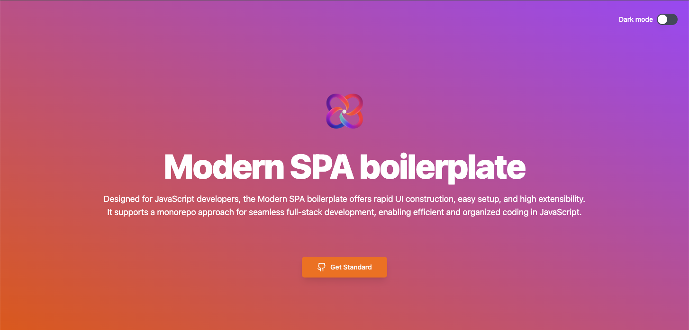

# Modern SPA boilerplate

**This boilerplate provides the best developing experience because it is easily set up, quickly builds UI components, and includes server-side and front-side that is written with Javascript.**

# Installation

## 1. Use this boilerplate
Visit this repository and click `Use this template` button.
https://github.com/shouheitakai9009/modern-spa

## 2. Start on your localhost
1. Open terminal and move your directory and type this command `yarn install`
2. type this command and start with vite `yarn dev`
3. type this command and start backend server `yarn server`

## 3. Let's start developing !!
You finally got everything you need to start developing.
Enjoy your development life!!
